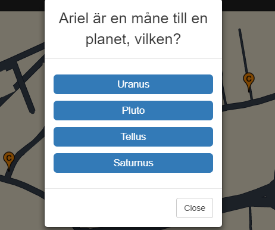

# strawberrygame.gouk.pw
We have made a game where you're supposed to conquer areas by answering questions. 
This game is GPS oriented and you play it on your mobilephone by walking to different markers on a map. When you're at a marker you need to press it and then a pop-up modal will appear with a question that you need to answer to be able to conquer that area. 

You choose a team when you create your account and you won't be able to change your team once your account is created.
You will also have access to a leaderboard where you can see which of the teams are in the lead.



## Motivation:
The reason we made this game is because it was an assignment that we got from our teachers and this project won't be maintained after march 2nd, 2018.

## Our game is built with/uses: 
- HTML5 
- CSS3 
- JavaScript 
- Bootstrap 
- PHP (Backend)
- MySQL (Database)
- React 
- GPS 
- JSON 
- REST API
- jQuery.ajax
- Node.js (Backend)
- Heroku (Hosting)
- Vimly (Hosting)

## Style guidelines:
- We use indentation (tab) of 1 space.
- We're using Atom Beautify.
- In the CSS files there's no indentation at the selector, ex:
```
html {
height: 100%;
}
```

## Getting started:
Clone or download our [repository](https://github.com/Elingustafsson/strawberry.git), download XAMPP, download Node.js, import our database (QuizDB.sql) from the db-map folder.

**_Link to our Trello:_**
<br>[Trello](https://trello.com/b/dwdiaIEn/strawberry)

**_Our game is hosted at this site:_**
<br>http://strawberrygame.gouk.pw/

## Contributers:
- **Viktor Stenqvist**
- **Tim Lappalainen**
- **Elin Gustafsson**
- **Paulina Lönngren**
- **Emmeline Mutka**
